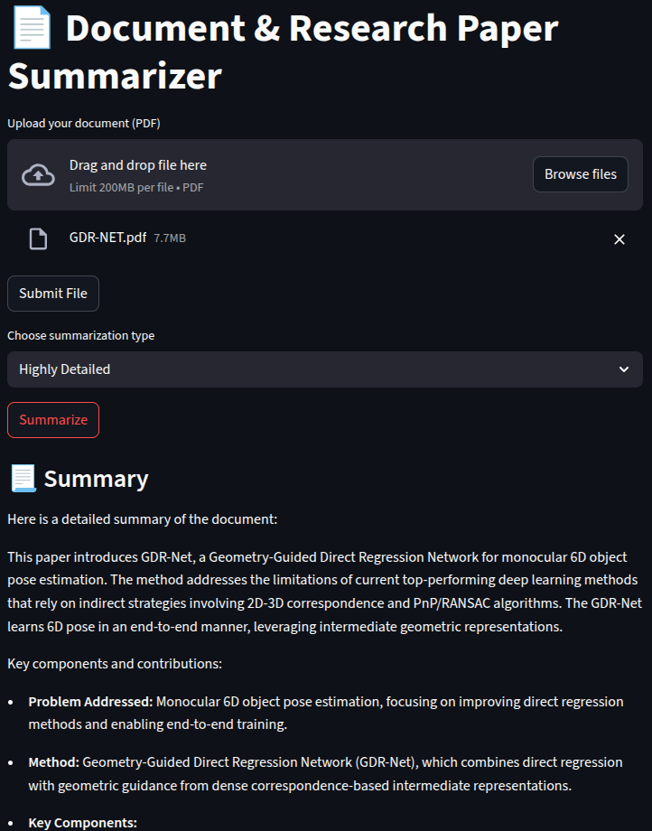

# 📄 Summarizer Tool using LLM (Gemini)

A Streamlit web app to intelligently summarize uploaded documents (PDF, TXT, DOCX) using **Google Gemini LLM**. Supports multiple summary styles like short, detailed, and bullet points — all generated with reference to the original document content.

---

## 🚀 Features

- 📁 Upload PDF documents
- ✅ Submit to process and extract text
- 🔄 Choose between summarization types:
  - Short
  - Detailed
  - Bullet Points
- 💬 Summarization powered by Gemini (Google LLM)
- 🧠 RAG-like grounded response (no hallucinations)
- ✨ Clean and intuitive Streamlit UI
- 📝 Markdown rendering for beautiful summaries

---

## 🎥 Demo



---

## 🛠️ Installation & Setup

### 1. Clone the repository

```bash
git clone https://github.com/your-username/document-summarizer-gemini.git
cd Summarizer_tool

```

### 2. Create a virtual enviornment.

```bash

python -m venv venv
source venv/bin/activate  # or venv\Scripts\activate on Windows

```

### 3. Install all the required dependencies

```bash

pip install -r requirements.txt

```

### 4.Add your Gemini API Key
Create a .env file and add your api key as shown below:

```bash
GOOGLE_API_KEY=your_api_key_here
```

### 5. Usage
Run the Streamlit app:

```bash
streamlit run app.py
```

